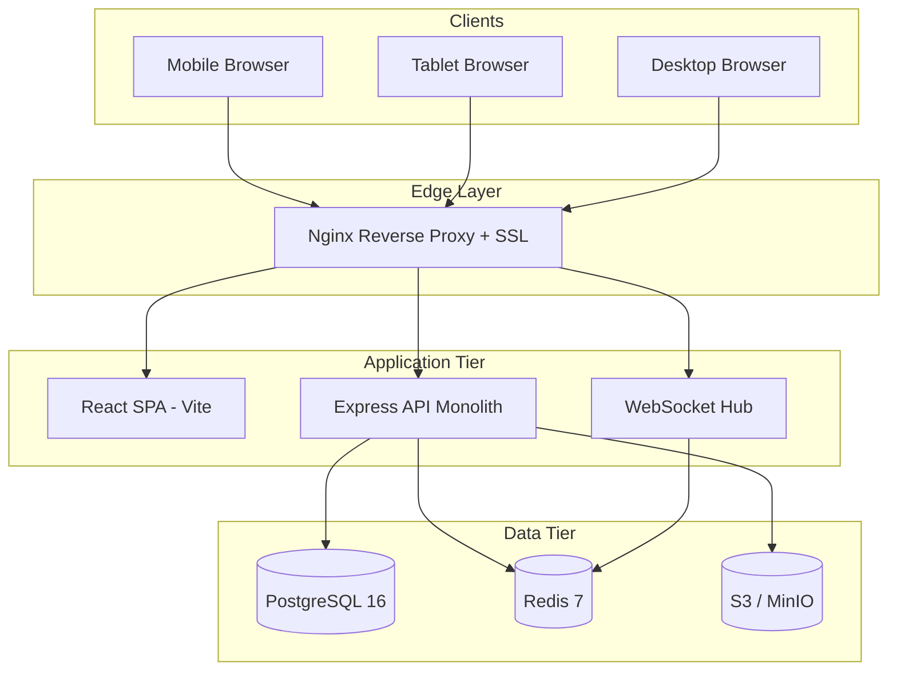
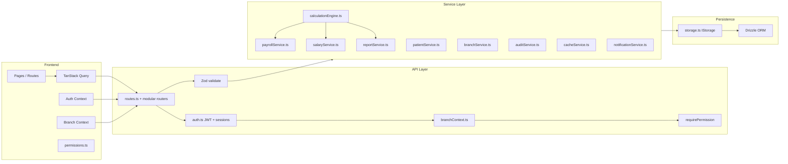
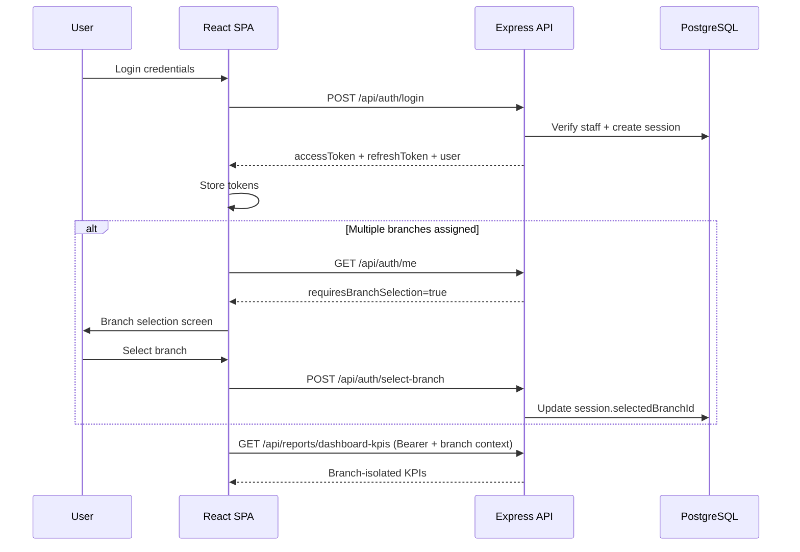
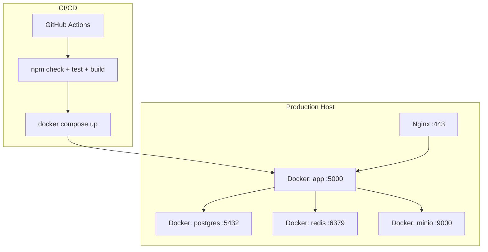

# Maximus Care — Enterprise Architecture

**Version:** 2.0 (evolution path)  
**Date:** 2026-06-10  
**Status:** In progress — production hardening

---

## 1. Strategic Stack Decision

| Layer | Specification target | Current implementation | Decision |
|-------|---------------------|------------------------|----------|
| Frontend | Next.js | React 19 + Vite + Wouter | **Evolve current SPA** — business logic and UI already built; migrate to Next.js only if SSR/SEO required |
| Backend | Python FastAPI | Node.js Express 5 + TypeScript | **Evolve current API** — `calculationEngine`, services, and 33+ tests already in TypeScript |
| ORM | SQLAlchemy + Alembic | Drizzle ORM + SQL migrations | **Keep Drizzle** — dual PG/SQLite schemas exist; PG-only for production |
| Cache | Redis | Redis (`ioredis`) + in-memory fallback | **Implemented** |
| Jobs | Celery | Inline schedulers + `scheduler.ts` scaffold | **Migrate to BullMQ** (Node Celery equivalent) in Phase 14 |
| Storage | S3 | AWS SDK + MinIO in Docker Compose | **Implemented** |
| Charts | ECharts | Recharts | **Keep Recharts** unless executive dashboards need ECharts-specific features |
| State | Zustand | React Query + Context | **Keep React Query** for server state; add Zustand only for client-only UI state if needed |

**Rationale:** ~65% of enterprise business rules are correctly centralized in `server/services/calculationEngine.ts`. A full FastAPI/Next.js rewrite duplicates risk and delays production readiness by 6–12 months.

---

## 2. System Context Diagram

---

## 3. Application Architecture

---

## 4. Authentication Flow

---

## 5. Module Boundaries

| Module | API Router | Service | Branch-isolated |
|--------|-----------|---------|-----------------|
| Auth | `routes.ts`, `routes/auth.ts` | `authService.ts` | N/A |
| Branches | `extended.ts` | `branchService.ts` | N/A |
| Patients | `routes.ts`, `routes/patients.ts` | `patientService.ts` | Partial |
| Visits | `routes.ts` | `visitPaymentService.ts` | Partial |
| Attendance | `routes.ts` | `attendanceService.ts` | No |
| Salary | `routes/salary.ts` | `salaryService.ts`, `payrollService.ts` | No |
| Reports | `extended.ts` | `reportService.ts`, `dashboardService.ts` | Partial |
| Tasks | `extended.ts` | `taskService.ts` | No |
| Notifications | `extended.ts` | `notificationService.ts` | No |
| Audit | `extended.ts` | `auditService.ts` | No |

---

## 6. Deployment Architecture

---

## 7. Cross-Cutting Concerns

| Concern | Implementation | Gap |
|---------|----------------|-----|
| Business calculations | `calculationEngine.ts` | None — single source of truth |
| Branch names | `shared/branches.ts` | Migrate remaining UI hardcodes |
| Permissions | `server/rbac/permissions.ts` | Some routes still use `requireRole` |
| Audit | `auditService.ts` | Not all mutations logged |
| Caching | `cacheService.ts` | Dashboard KPIs not yet cached |
| Realtime | `wsHub.ts` | WebSocket notifications partial |
| File storage | `fileStorageService.ts` | S3 integration needs production config |

---

## 8. Scalability Path

1. **Phase A (now):** PostgreSQL-only production, Redis cache, branch isolation
2. **Phase B:** BullMQ job queue for payroll/report generation
3. **Phase C:** Read replicas for reporting if load exceeds single PG instance
4. **Phase D:** Extract notification service if WebSocket fan-out becomes bottleneck

---

*See also: `database-erd.md`, `rbac-matrix.md`, `api-documentation.md`, `production-readiness-report.md`*
