# Maximus Care — Database ERD

**ORM:** Drizzle (`shared/schema-pg.ts` for PostgreSQL)  
**Migrations:** `drizzle/migrations/`, `server/migrations/part*.ts`

---

## 1. Enterprise Entity Relationship Diagram

```mermaid
erDiagram
    branches ||--o{ user_branch_access : grants
    staff ||--o{ user_branch_access : has
    staff ||--o{ auth_sessions : authenticates
    staff ||--o{ attendance : records
    staff ||--o{ staff_fines : receives
    staff ||--o{ staff_deductions : receives
    staff ||--o{ staff_ot_entries : earns
    staff ||--o{ salaries : paid_via
    staff ||--o{ staff_incentives : earns
    staff ||--o{ tasks : assigned
    staff ||--o{ notifications : receives
    staff ||--o{ visits : treats

    branches ||--o{ patients : hosts
    patients ||--o{ visits : has
    patients ||--o{ appointments : books
    patients ||--o{ patient_documents : stores
    patients ||--o{ patient_notes : has
    patients ||--o{ home_visits : receives

    visits ||--o{ visit_payments : settled_by

    in_patient_admissions ||--o{ in_patient_sessions : contains
    in_patient_admissions ||--o{ in_patient_discharges : ends
    in_patient_admissions ||--o{ in_patient_payments : billed
    in_patient_admissions ||--o{ in_patient_extra_expenses : incurs

    tasks ||--o{ task_assignments : multi_assign

    staff ||--o{ audit_logs : performs
    staff ||--o{ expenses : submits

    branches {
        varchar id PK
        text name UK
        text branch_name
        text code
        int is_active
    }

    user_branch_access {
        varchar id PK
        varchar staff_id FK
        varchar branch_id FK
        int is_default
    }

    staff {
        varchar id PK
        text email UK
        text role
        text branch
        decimal basic_salary
        timestamp deleted_at
    }

    patients {
        varchar id PK
        text patient_code
        text name
        text branch
        varchar branch_id FK
        text status
        timestamp deleted_at
    }

    visits {
        varchar id PK
        varchar patient_id FK
        varchar treating_staff_id FK
        date visit_date
        text branch
        varchar branch_id FK
        decimal payment_amount
        text payment_status
        timestamp deleted_at
    }

    attendance {
        varchar id PK
        varchar staff_id FK
        date date
        text status
        text check_in
        text check_out
    }

    salaries {
        varchar id PK
        varchar staff_id FK
        text salary_month
        decimal final_salary
        text status
        json snapshot_data
    }

    auth_sessions {
        varchar id PK
        varchar staff_id FK
        varchar selected_branch_id
        text refresh_token_hash
        timestamp expires_at
    }

    audit_logs {
        varchar id PK
        text user_id
        text action
        text entity_type
        text entity_id
        timestamp created_at
    }
```



---

## 2. Table Inventory (35+ entities)

### Identity & Access
| Table | Purpose |
|-------|---------|
| `staff` | Users (staff = user model) |
| `auth_sessions` | Sessions with `selected_branch_id`, refresh tokens |
| `user_branch_access` | Staff-to-branch grants |
| `password_reset_tokens` | Password recovery (Part 8) |

### Organization
| Table | Purpose |
|-------|---------|
| `branches` | Four enterprise branches |
| `clinic_settings` | Global rate configuration (singleton) |
| `incentive_settings` | Incentive toggle per scope |

### Clinical
| Table | Purpose |
|-------|---------|
| `patients` | Outpatient registry (`PAT000001` codes) |
| `visits` | Clinic/outpatient sessions |
| `visit_payments` | Payment ledger per visit |
| `appointments` | Scheduled appointments |
| `home_visits` | Home visit records |
| `patient_documents` | Document metadata |
| `patient_notes` | Clinical notes |

### Inpatient
| Table | Purpose |
|-------|---------|
| `in_patient_admissions` | IP admissions |
| `in_patient_sessions` | IP therapy sessions |
| `in_patient_discharges` | Discharge records |
| `in_patient_payments` | IP payments |
| `in_patient_extra_expenses` | Extra IP charges |

### HRM & Payroll
| Table | Purpose |
|-------|---------|
| `attendance` | Present/Absent/Leave/Holiday |
| `staff_fines` | Fine records |
| `staff_deductions` | Deduction records |
| `staff_ot_entries` | Overtime |
| `salaries` | Monthly salary records with snapshots |
| `staff_incentives` | Incentive line items |
| `payroll_snapshots` | Immutable payroll snapshots |
| `expenses` | Clinic expenses |

### Operations
| Table | Purpose |
|-------|---------|
| `tasks` | Task management |
| `task_assignments` | Multi-assignee tasks |
| `notifications` | In-app notifications |
| `audit_logs` | Audit trail |

---

## 3. Enterprise Branch Seed Data

| Code | Name | Short Name |
|------|------|------------|
| DEHIWALA | Dehiwala Main Branch | Dehiwala |
| BANDARAGAMA | Bandaragama Branch | Bandaragama |
| NEURO | Neuro Rehabilitation Unit | Neuro Rehabilitation |
| NEXUS | Nexus Physio & Rehab Center | Nexus Physio |

Source: `shared/branches.ts` — single source of truth.

---

## 4. Schema Gaps vs Enterprise Target

| Requirement | Status | Action |
|-------------|--------|--------|
| `branch_id` FK on all branch-scoped tables | Partial (`patients`, `visits` have optional FK) | Phase 2: NOT NULL + backfill |
| Soft deletes | Partial (patients, visits, staff, tasks) | Extend to appointments, attendance |
| `UNIQUE(staff_id, salary_month)` | Missing | Add constraint in migration |
| `in_patient_admissions.patient_id` FK | Missing | Link to patients table |
| Per-branch settings | Global singleton | Add `branch_settings` table |
| Normalized roles/permissions tables | Code-only RBAC | Optional Phase 12 enhancement |
| Document S3 metadata | `file_uri` only | Add `s3_key`, `checksum`, `mime_type` |

---

## 5. Critical Indexes

| Index | Table | Columns |
|-------|-------|---------|
| `idx_visits_branch_date` | visits | `(branch_id, visit_date)` |
| `idx_patients_code` | patients | `(patient_code)` |
| `idx_attendance_staff_date` | attendance | `(staff_id, date)` |
| `idx_salaries_staff_month` | salaries | `(staff_id, salary_month)` UNIQUE |
| `idx_audit_created` | audit_logs | `(created_at DESC)` |

Runtime indexes created in `server/migrations/part6-9*.ts`; must be synced to Drizzle schema for fresh deploys.

---

## 6. Branch Isolation Model

```
staff → user_branch_access → branches
auth_sessions.selected_branch_id → branches.id
API middleware (requireBranchContext) → filters queries by selected branch name/id
Management roles (Admin, MD) → all branches; optional "all branches" dashboard view
```

---

*Migrations: `drizzle/migrations/001_audit_notifications_tasks.sql`, `002_part2_forward.sql`*
