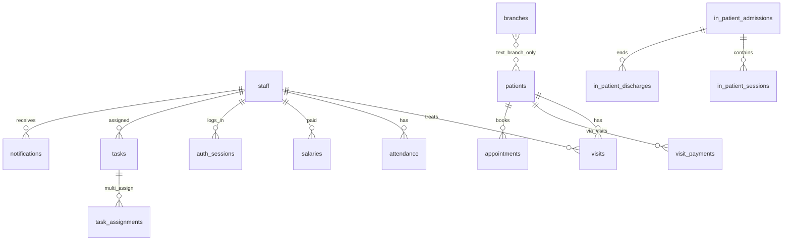

# MAXIMUS CARE — Phase 1 System Audit

**Audit date:** 2026-06-10  
**Scope:** Full-stack clinic management system (current codebase)  
**Auditor role:** CTO / Principal Architect review  

---

## Executive Summary

The existing **Maximus Clinic Manager** is a **Node.js + Express + React (Vite) monolith** with **Drizzle ORM**, dual **SQLite/PostgreSQL** support, and a growing service layer. Significant Part 2–8 features have been added (reports, salary workflow, tasks, notifications, RBAC matrix, audit logs) but the system is **not yet enterprise-ready** and **does not match the target stack** (Next.js, FastAPI, Redis, Celery, etc.).

| Dimension | Current maturity | Target |
|-----------|------------------|--------|
| Architecture | Monolithic SPA + API | Microservice-ready, containerized |
| Database | SQLite default, partial PG | PostgreSQL only, normalized multi-branch |
| Auth | Bearer sessions, role strings | JWT + refresh, DB RBAC |
| Branch model | 2 hardcoded branches (Colombo/Bandaragama) | 4 branches, post-login selection, isolation |
| Business logic | Centralized in `calculationEngine.ts` ✓ | Same principle, extend coverage |
| Tests | 19 unit tests | Full pyramid (unit/integration/E2E/security) |
| Performance | No cache, no background queue | Redis, Celery, <3s dashboards |
| Security | Partial (helmet, rate limit) | Full enterprise controls |
| Deployment | Manual `npm start` | Docker, CI/CD, Nginx, SSL |

**Recommendation:** Treat the target stack as a **greenfield migration path** OR a **phased evolution** of the current stack. A full rewrite to FastAPI + Next.js is 6–12 months; stabilizing and hardening the current stack for production can proceed in parallel with schema normalization and multi-branch work.

---

## 1. Architecture Report

### 1.1 Current Architecture

```
┌─────────────────────────────────────────────────────────────┐
│                    Browser (React 19 SPA)                    │
│  Vite · Wouter · TanStack Query · Tailwind · Radix/shadcn   │
└────────────────────────────┬────────────────────────────────┘
                             │ HTTP /api (Bearer session)
┌────────────────────────────▼────────────────────────────────┐
│              Express 5 Monolith (port 5000)                    │
│  routes.ts + hrm | patients | salary | extended routers       │
│  auth.ts · permissions.ts · rbac/permissions.ts (unused MW)  │
└────────────────────────────┬────────────────────────────────┘
                             │
        ┌────────────────────┼────────────────────┐
        ▼                    ▼                    ▼
  server/services/*    server/storage.ts      Scheduled jobs
  calculationEngine    (IStorage facade)      (inline in routes.ts)
  payrollService       Drizzle ORM
  reportService        SQLite | PostgreSQL
  salaryService
```

**Entry points:**
- `server/index.ts` — boot, security middleware, schema migration, seed, listen
- `client/src/main.tsx` — React mount
- `client/src/App.tsx` — routing, providers

### 1.2 Target Architecture (per specification)

| Layer | Target | Gap |
|-------|--------|-----|
| Frontend | Next.js, Zustand, ECharts | React + Vite, no Zustand, Recharts |
| Backend | Python FastAPI, SQLAlchemy, Alembic | Node Express, Drizzle |
| Realtime | WebSockets + Notification Service | `ws` dependency present, not wired to UI |
| Cache | Redis | None |
| Jobs | Celery | Inline `setInterval` in routes |
| Storage | S3-compatible | Local file URIs only |
| Reporting | Pandas, OpenPyXL, ReportLab | exceljs, jspdf (client-side export) |
| Infra | Docker, Nginx, GitHub Actions | None configured |

### 1.3 Module Maturity Assessment

| Module | Status | Notes |
|--------|--------|-------|
| **Patients** | Functional | CRUD, documents, notes, export, dashboard; no admission/discharge workflow for outpatients |
| **Visits** | Functional | Sessions, payments, home visit sync |
| **In-patients** | Functional | Admissions disconnected from `patients` table (denormalized name) |
| **Appointments** | Basic | No calendar view, no visit linkage, no branch, hard delete |
| **Attendance** | Strong | Present/Absent/Leave/Holiday, OT, auto-fine, monthly summary |
| **Salary** | Strong | Preview → generate → approve → pay workflow; snapshots exist |
| **Incentive** | Correct formula | Implemented in `calculationEngine.ts`; Colombo-only clinic visits |
| **Reports** | Good coverage | Revenue, incentive, attendance, expenses, unpaid, sessions, staff, branch KPIs |
| **Tasks** | Basic | Assign, complete; escalation partial |
| **Notifications** | Basic | In-app bell; no WebSocket push |
| **Branches** | Immature | Master table exists; UI uses hardcoded Colombo/Bandaragama; no post-login selector |
| **Audit** | Partial | `audit_logs` table + service; inconsistent coverage |
| **Settings** | Basic | Global singleton rates; not per-branch |

### 1.4 Business Logic Centralization (verified)

All financial calculations flow through `server/services/calculationEngine.ts`:

- **Incentive:** `count = colomboClinicVisits + floor(ipSessions / 2)`; if `count >= minCount` then `amount = count × perCount`
- **Salary:** `basic + incentive + homeVisits + OT - fines - extraHolidayDeduction - otherDeductions`
- **Home visits:** Colombo / Bandaragama / Holiday classification via attendance
- **Revenue:** Paid/partially-paid visit eligibility rules

**Risk:** Some client-side stats in `client/src/lib/stats.ts` duplicate branch logic — should be removed in favor of API-only calculations.

---

## 2. Dependency Report

### 2.1 Runtime Dependencies (key)

| Package | Version | Purpose |
|---------|---------|---------|
| express | ^5.0.1 | HTTP server |
| drizzle-orm | ^0.39.3 | ORM |
| @libsql/client | ^0.14.0 | SQLite driver |
| pg | ^8.16.3 | PostgreSQL driver |
| react | ^19.2.0 | UI |
| vite | ^7.1.9 | Build (devDep) |
| @tanstack/react-query | ^5.60.5 | Server state |
| wouter | ^3.3.5 | Routing |
| zod | ^3.25.76 | Validation |
| bcryptjs | ^3.0.3 | Password hashing |
| helmet | ^8.1.0 | Security headers |
| express-rate-limit | ^7.5.0 | Rate limiting |
| exceljs | ^4.4.0 | Excel export |
| jspdf | ^4.2.1 | PDF export |
| recharts | ^2.15.4 | Charts |
| ws | ^8.18.0 | WebSockets (unused in prod path) |

### 2.2 Missing Target Dependencies

| Target | Status |
|--------|--------|
| Next.js | Not present |
| FastAPI / Python stack | Not present |
| Redis (ioredis, etc.) | Not present |
| Celery / BullMQ | Not present |
| AWS SDK / MinIO client | Not present |
| Pandas / ReportLab | Not present (server-side) |
| JWT library (jsonwebtoken) | Not present — custom session tokens |
| ECharts | Not present — Recharts used |
| Zustand | Not present |
| Docker / docker-compose | Not present |

### 2.3 Dependency Risks

1. **Passport + express-session** installed but unused — dead weight, confusion risk
2. **Dual schema files** (`schema-sqlite.ts`, `schema-pg.ts`) — drift risk on every change
3. **Money as TEXT on SQLite** — precision and sorting risks
4. **No lockfile audit CI** — supply chain exposure
5. **Vitest only** — no Playwright/Cypress for E2E

---

## 3. Database ERD

### 3.1 Entity Relationship (current)



### 3.2 Table Inventory (31 entities)

**Core:** staff, branches, clinic_settings, incentive_settings  
**Clinical:** patients, visits, visit_payments, appointments, home_visits, patient_documents, patient_notes  
**Inpatient:** in_patient_admissions, in_patient_sessions, in_patient_discharges, in_patient_payments, in_patient_extra_expenses  
**HRM:** attendance, staff_fines, staff_deductions, staff_ot_entries, salaries, staff_incentives, payroll_snapshots, expenses  
**Ops:** tasks, task_assignments, notifications, audit_logs, auth_sessions  
**Migration-only (Part 8):** password_reset_tokens, system_logs  

### 3.3 Schema Gaps vs Enterprise Target

| Requirement | Current | Required action |
|-------------|---------|-----------------|
| Separate users/roles/permissions tables | staff = user | Add normalized IAM tables |
| branch_id FK on all branch-scoped data | Text `branch` + optional `branch_id` | FK to branches, enforce NOT NULL |
| Soft deletes everywhere | Partial | Extend to appointments, inpatient |
| Audit fields on all mutable rows | Partial | Add created_by/updated_by consistently |
| UNIQUE (staff_id, salary_month) | Missing | Add constraint |
| Patient FK on admissions | Missing | Link in_patient_admissions.patient_id |
| Per-branch settings | Global singleton | branch_settings table |
| Documents storage metadata | file_uri only | S3 key, checksum, mime, size |

### 3.4 Branch Data Mismatch

**Codebase defaults:** Colombo, Bandaragama  
**Specification requires:**
1. Dehiwala Main Branch
2. Bandaragama Branch
3. Neuro Rehabilitation Unit
4. Nexus Physio & Rehab Center

Migration must rename/seed branches and update all hardcoded references in UI and `calculationEngine.classifyHomeVisit`.

---

## 4. Security Report

### 4.1 Implemented Controls

| Control | Implementation | File |
|---------|----------------|------|
| Password hashing | bcryptjs | `server/seed.ts`, auth login |
| Session auth | Bearer token in `auth_sessions` | `server/auth.ts` |
| Rate limiting | 120/min global, 10/15min login | `server/index.ts` |
| Security headers | helmet (CSP disabled) | `server/index.ts` |
| Body size limits | 1mb JSON | `server/index.ts` |
| Role checks | `requireRole`, `permissions.ts` | Routes |
| RBAC matrix | Defined but not middleware | `server/rbac/permissions.ts` |
| Audit logging | `auditService.logAudit` | Partial route coverage |
| Input validation | Zod on some routes | `server/middleware/validate.ts` |

### 4.2 Security Gaps (Critical → Medium)

| Severity | Issue | Recommendation |
|----------|-------|----------------|
| **Critical** | No JWT/refresh token rotation | Implement short-lived access + refresh |
| **Critical** | Sessions in localStorage (`session_token`) | HttpOnly secure cookies + CSRF |
| **Critical** | CSP disabled | Enable strict CSP for production |
| **High** | RBAC matrix not enforced on routes | Replace `requireRole` with `requirePermission` |
| **High** | No branch isolation enforcement | Middleware: filter all queries by `selected_branch_id` |
| **High** | Alternate auth routes unwired | Consolidate auth; enable password reset securely |
| **High** | No MFA | Add TOTP for Admin/MD |
| **Medium** | `audit_logs.user_id` not FK-enforced | Enforce + log all PHI access |
| **Medium** | File uploads — local URI, no virus scan | S3 + presigned URLs + MIME validation |
| **Medium** | No encryption at rest for PHI | PG TDE or field-level encryption for sensitive fields |
| **Medium** | Part 8 tables created lazily | Run part8 on boot; add to Drizzle schema |
| **Low** | No security test suite | Add OWASP ZAP / auth fuzz tests |

### 4.3 RBAC Matrix (current app-level)

| Permission | Admin | MD | Receptionist | Physio | Staff |
|------------|:-----:|:--:|:------------:|:------:|:-----:|
| salary.manage | ✓ | ✓ | | | |
| salary.view_own | ✓ | ✓ | | ✓ | ✓ |
| reports.view | ✓ | ✓ | | ✓ | ✓ |
| reports.export | ✓ | ✓ | | | |
| branches.manage | ✓ | ✓ | | | |
| patients.manage | ✓ | ✓ | ✓ | | |
| critical.delete | ✓ | | | | |

**Gap:** No per-branch permission scoping; no custom role assignment in DB.

---

## 5. Performance Report

### 5.1 Current Characteristics

| Area | Observation |
|------|-------------|
| Dashboard KPIs | Multiple aggregate queries per request in `dashboardService` / `reportService` |
| Caching | None — every request hits DB |
| Pagination | Partial — some list endpoints return full datasets |
| Indexes | Runtime-created; not in Drizzle schema — risk of missing on fresh PG deploy |
| Background work | Salary generation, reports run synchronously in HTTP handler |
| Client | `staleTime: Infinity` on React Query — stale data risk, but fewer requests |
| SQLite default | Single-writer bottleneck for concurrent clinic load |

### 5.2 Estimated Hot Paths

1. `GET /api/reports/dashboard-kpis` — joins visits, attendance, expenses, payroll
2. `POST /api/salary/generate` — bulk staff iteration
3. `GET /api/patients` — full list without server pagination
4. Main dashboard `home.tsx` — 5+ parallel API calls

### 5.3 Performance Targets vs Current

| Metric | Target | Current estimate | Gap |
|--------|--------|------------------|-----|
| Dashboard load | < 3s | 2–8s (data volume dependent) | Redis cache, query optimization |
| Reports | < 5s | 3–15s for large ranges | Background jobs + polling |
| Concurrent users | 50+ | ~10 on SQLite | PostgreSQL + connection pool |
| API p95 | < 500ms | Unmeasured | APM required |

### 5.4 Recommendations

1. Mandate PostgreSQL in production; remove SQLite for multi-user
2. Add Redis cache for dashboard KPIs (TTL 60–300s)
3. Server-side pagination on patients, visits, attendance, salary history
4. Materialized views or nightly aggregates for executive reports
5. Move payroll generation to job queue with progress WebSocket
6. Add composite indexes: `(branch_id, visit_date)`, `(staff_id, date)`, `(patient_id, visit_date)`

---

## 6. Bug Report

### 6.1 Confirmed / High-Likelihood Issues

| ID | Severity | Description | Location |
|----|----------|-------------|----------|
| B-001 | High | Part 8 migration not in boot sequence — indexes/tables may be missing until logger runs | `server/db.ts` vs `part8SchemaMigration.ts` |
| B-002 | High | Dual auth implementations — `routes/auth.ts` unused; password reset non-functional | `server/routes/auth.ts` |
| B-003 | High | Branch name mismatch — spec vs code (Colombo vs Dehiwala) | UI + seed + calculationEngine |
| B-004 | Medium | `useBranches()` hook exists but no UI consumes it — branch CRUD API orphaned | `client/src/hooks/useData.ts` |
| B-005 | Medium | Legacy `DataProvider` still mounted — potential stale localStorage data | `client/src/context/data-context.tsx` |
| B-006 | Medium | Client-side branch stats duplicate server logic | `client/src/lib/stats.ts` |
| B-007 | Medium | Inpatient admissions not linked to patients — duplicate data, reporting errors | `in_patient_admissions` schema |
| B-008 | Medium | Duplicate salary records possible — no UNIQUE on (staff_id, salary_month) | `salaries` table |
| B-009 | Low | `scheduler.ts` and `eventBus` scaffolded but never registered | `server/jobs/scheduler.ts` |
| B-010 | Low | Appointments hard-deleted — no audit trail | `storage.ts` |

### 6.2 Test Status

```
Test Files  3 passed (3)
Tests       19 passed (19)
```

Coverage limited to: `clinicTime`, `calculationEngine`, `payrollService`. No API, report, or attendance integration tests.

---

## 7. Technical Debt Report

### 7.1 Debt Register (prioritized)

| Priority | Item | Effort | Impact |
|----------|------|--------|--------|
| P0 | Normalize branch model + post-login branch selection | 2–3 weeks | Multi-branch correctness |
| P0 | Enforce RBAC middleware on all routes | 1 week | Security |
| P0 | PostgreSQL-only production path + migration | 1 week | Scalability |
| P1 | Consolidate auth (single path, JWT or secure cookies) | 2 weeks | Security |
| P1 | Remove hardcoded Colombo/Bandaragama from UI | 1 week | Maintainability |
| P1 | Wire part8 migration on boot; sync Drizzle schema | 3 days | Schema integrity |
| P1 | Server pagination on all list endpoints | 1 week | Performance |
| P2 | Remove dead code (passport, data-context, unused auth routes) | 2 days | Clarity |
| P2 | Extract schedulers from routes.ts to job module | 3 days | Architecture |
| P2 | Add integration test suite | 2 weeks | Quality |
| P3 | Migrate to target stack (FastAPI/Next.js) OR commit to Node stack | 3–6 months | Strategic |

### 7.2 Code Smell Hotspots

| File | Lines | Issue |
|------|-------|-------|
| `server/routes.ts` | ~2088 | God file — routes + schedulers + business logic |
| `server/storage.ts` | Large | God repository — all tables |
| `client/src/hooks/useData.ts` | ~1000 | All React Query hooks in one file |
| `client/src/pages/attendance/index.tsx` | ~1000 | Page-level complexity |

### 7.3 Duplication Inventory

- Branch names: UI selects, types.ts, calculationEngine, storage seed, incentive scope
- Permissions: `server/permissions.ts`, `server/rbac/permissions.ts`, `client/lib/permissions.ts`
- Auth: `routes.ts` inline, `routes/auth.ts`, `authService.ts`
- Stats: `client/lib/stats.ts` vs `reportService.ts` / `dashboardService.ts`

---

## 8. Phase Roadmap (2–16)

| Phase | Focus | Prerequisite | Est. duration |
|-------|-------|--------------|---------------|
| **1** | System audit ✓ | — | Complete |
| **2** | Database refactor (FKs, indexes, soft delete, branch_id) | Audit sign-off | 3–4 weeks |
| **3** | Multi-branch (4 branches, selection screen, isolation) | Phase 2 | 2–3 weeks |
| **4** | Dashboards (KPIs + trends, branch-scoped) | Phase 3 | 2 weeks |
| **5** | Enterprise reporting (PDF/Excel/CSV server-side) | Phase 4 | 3 weeks |
| **6** | Patient management (PAT IDs, admission workflow) | Phase 2 | 2–3 weeks |
| **7** | Attendance hardening | Phase 2 | 1 week |
| **8** | Incentive engine verification | Exists — validate + tests | 3 days |
| **9** | Salary engine + immutable snapshots | Exists — add constraints | 1 week |
| **10** | Appointments (calendar, reminders) | Phase 3 | 2 weeks |
| **11** | Tasks (escalation, notify) | Partial — extend | 1 week |
| **12** | Security (JWT, RBAC MW, audit, encryption) | Phase 2–3 | 3–4 weeks |
| **13** | Mobile optimization | Ongoing | 1–2 weeks |
| **14** | Performance (Redis, jobs, indexes) | Phase 12 | 2–3 weeks |
| **15** | Testing pyramid | Parallel from Phase 2 | Ongoing |
| **16** | Deployment (Docker, CI/CD, Nginx, monitoring) | Phase 14–15 | 2–3 weeks |

**Strategic decision required:** Evolve current Node/React stack vs greenfield FastAPI/Next.js. The current codebase already implements ~60% of business logic correctly in `calculationEngine.ts`; a full rewrite duplicates risk.

---

## 9. Immediate Next Actions (Phase 2 kickoff)

1. **Branch seed migration** — Replace Colombo/Bandaragama with the four specified branches; map legacy data
2. **Add `user_branch_access` table** — `staff_id`, `branch_id`, `is_default`
3. **Post-login branch selection API + UI** — Store `selected_branch_id` in session
4. **Branch isolation middleware** — Inject `branchId` into all service queries
5. **Run part8 migration on boot** — Align Drizzle schema with runtime
6. **Add UNIQUE constraint** on `salaries(staff_id, salary_month)`
7. **Replace `requireRole` with `requirePermission`** across all routers

---

*End of Phase 1 Audit*
